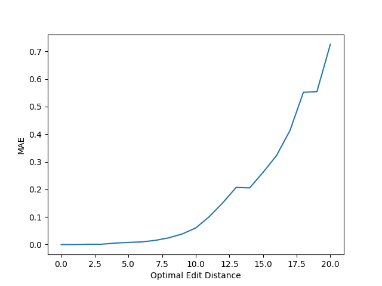

# Approximate-String-Matching

This repository contains experimental scripts of approximate string matching algorithms.

- [x] Needleman-Wunsch Algorithm
- [ ] Landau-Vishkin Algorithm (backtracking missing)
- [x] LEAP

## Idea of Greedy Approximate String Matching Algorithm

1. Starting from the current position, 


## Current problems with Greedy ASM Algorithm

1. It is not able to find the optimal path between highways. For example, an optimal match between two DNAs look like the following,

   ```
   AGAGCTAAAC-ATGGCCGCACATAAATCGTTTTGAG-TTGAA-A-CTTTACCGCTGCATCTA-TTTTTCTCCTAGAATTATACCGTACACAGCCGAC-GTTCCACC
   AGAGCTAAACAAGGGGCCCACATTAA-CGTTTTGAGCTTGAAGATCTTTACCGC-G-ATCTATTTTTTCTCCTAG-A-T-TACCGTACACA-CCGACACTTCCATC
   ```
   But GASMA will give the following results,
   ```
   AGAGCTAAACATGG-CCGCACATAAATCGTTTTGAGTT-GAA--ACTTTACCGCTGCATCTATTTT-TCTCCTAGAATTATACCGTACACAGCCG-ACGTTCCACC
   AGAGCTAAACAAGGGGCCCACATTAA-CGTTTTGAGCTTGAAGATCTTTACCGC--GATCTATTTTTTCTCCTAGAT---TACCGTACACACC-GACACTTCCATC
   ```

   As a result, the calculated edit distance is 24 instead of 19, which is optimal. For now I always switch lanes at the end of each highway and and then go directly to the next highway, so there will be some errors in between.
   
   **Potential solution**: Maybe use traditional DP to find optimal path between highways?

   **Potential solution 2**: Maybe we can also extract those high-speed bridges (like `G-A-T-T` above) and put them into considerations?

   **Potential solution 3**: Leave them as-is and 

2. There are currently too many parameters for GASMA. Including:

   - `z` Maximum length of streaks of zeros we are skipping
   - `o` Maximum length of streaks of ones we are skipping
   - `k` as in Banded Levenshtein distance problem
   - `sight` which indicates the range of highway we are choosing from

   And choosing those parameters can greatly affect performance.

   - `z=2, o=2, sight=3`, we have `MAE=2.396, CR=0.314`
   - `z=0, o=0, sight=3`, we have `MAE=1.29, CR=0.459`
   - `z=0, o=0, sight=5`, we have `MAE=2.002, CR=0.194`

3. Currently I abandoned the greedy algorithm that tried to find global optimum, because it is unstable when `k` goes large. Too many highways to consider also make it very slow.

## Current Benchmark Results

With 20,000 samples with random error rate, we can calculate the following statistics:

### Mean Absolute Error

The mean absolute error between result of GASMA and Needleman Wunsch




### Correct Rate

The proportion of test cases where GASMA correctly identified the optimal edit distance


### Relative Error

The relative absolute error with respect to the optimal edit distance

